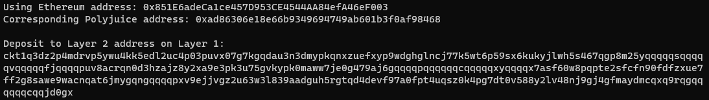

1. A screenshot of the console output immediately after you have successfully generated your Deposit Receiver Address.



2. Your Deposit Receiver Address (in text format).

```
ckt1q3dz2p4mdrvp5ywu4kk5edl2uc4p03puvx07g7kgqdau3n3dmypkqnxzuefxyp9wdghglncj77k5wt6p59sx6kukyjlwh5s467qgp8m25yqqqqqsqqqqqvqqqqqfjqqqqpuv8acrqn0d3hzajz8y2xa9e3pk3u75gvkypk0maww7je0g479aj6gqqqqpqqqqqqcqqqqqxyqqqqx7asf60w8pqpte2sfcfn90fdfzxue7ff2g8sawe9wacnqat6jmygqngqqqqpxv9ejjvgz2u63w3l839aadguh5rgtqd4devf97a0fpt4uqsz0k4pg7dt0v588y2lv48nj9gj4gfmaydmcqxq9rqgqqqqqqcqqjd0gx
```

3. The Ethereum address used to generate the Deposit Receiver Address (in text format).

```
0x851E6adeCa1ce457D953CE4544AA84efA46eF003
```

4. A link to the Etherscan explorer for the successful Force Bridge transaction. This can be found on Force Bridge under History→Succeed.

```
https://rinkeby.etherscan.io/tx/0x189d48a35897e71c12b7dc28bf59fe971b5ec10507b8ea3a4f289d94b651d8c9
```

5. A link to the Nervos explorer for the successful Force bridge transaction. This can be found on Force Bridge under History→Succeed.

```
https://explorer.nervos.org/aggron/transaction/0xf685cc27604d188598e56705daeb233f11ca9b2c25b3fcda4771f353245a392b
```