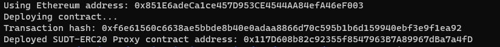
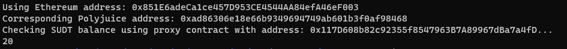

1. A screenshot of the console output immediately after deploying smart contract.



2. The address of the ERC20 Proxy Contract you deployed (in text format).

```
0x117D608b82c92355f8547963B7A89967dBa7a4fD
```

3. A screenshot of the console output immediately after checking your SUDT balance.



4. The Ethereum address that was checked (in text format).
```
0x851E6adeCa1ce457D953CE4544AA84efA46eF003
```