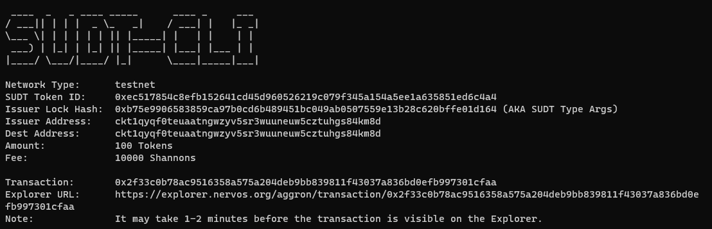
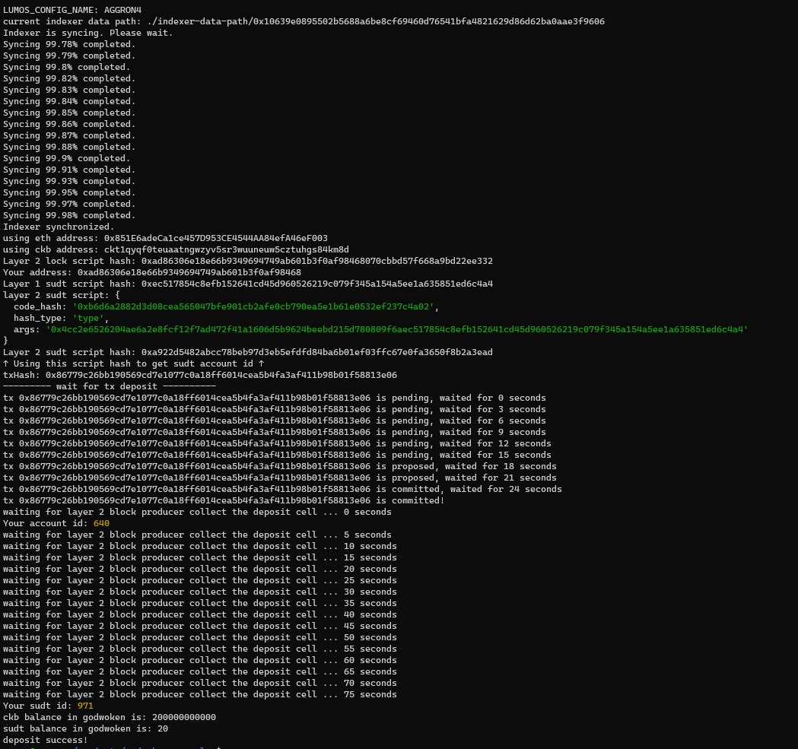

1. A link to the Layer 1 address you funded on the Testnet Explorer.

```
https://explorer.nervos.org/aggron/address/ckt1qyqf0teuaatngwzyv5sr3wuuneuw5cztuhgs84km8d
```

2. A screenshot of the console output immediately after using sudt-cli to create your SUDT tokens on Layer 1.



3. A link to the transaction ID created by sudt-cli on the Testnet Explorer.

```
https://explorer.nervos.org/aggron/transaction/0x2f33c0b78ac9516358a575a204deb9bb839811f43037a836bd0efb997301cfaa
```
4. A screenshot of the console output immediately after you have successfully submitted a deposit to Layer 2 using the account-cli tool.



5. The SUDT ID from the console output after executing the deposit script (in text format).

```
971
```